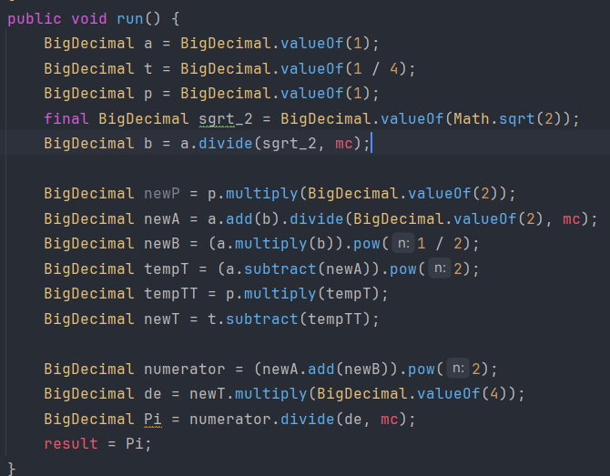

# Project Title

Calculating value of Pi

# Description

in this project we want to calculate Pi with some Algorithms and then choose the better one and write code and using multithread to calculate

## Pi Problem

0.1 :

### Leibniz's Formula 

For other formulas known under the same name, see List of things named after Gottfried Leibniz.
In mathematics, the Leibniz formula for π, named after Gottfried Wilhelm Leibniz

its not a good algorithm for calculating Pi and it dont pass any tests

if we calculate the series from 0 to 100 the result of pi will be 13.1012 and if we countinue the n the result will be bigger than 16 even 

0.2 :

### Chudnovsky Algorithm

its not good too because i get some exceptions and my program was not work true

the code of the loop (the task that should be done with threadPool) :

0.3 :

### gauss Legendre 

it is better than the 1 and 2 algorithm but its not good enough because it has a little difference with the real values 

for example i give 3.15 instead of 3.14 for floatingPoint = 2 but the difference will be smaller in bigger floating points

the most different part of this algorithm and the others is the being recursive

code : 

some thing about code : a is the nth value of a and newA is the (n+1)th value

0.4 :

### Borwein's Algorithm for Compute π (BBP)

The Bailey–Borwein–Plouffe formula (BBP formula) is a formula for π. It was discovered in 1995 by Simon Plouffe and is named after the authors of the article in which it was published, David H. Bailey, Peter Borwein, and Plouffe.[1] Before that, it had been published by Plouffe on his own site.[2] The formula is

 

my try to use this method ended to some exceptions

code :

0.5 :

### Ramanujan

its the best algorithm because i passed all test after try this method

you can view the code of this method in PiCalculator class

## Resources

all of pictures and descriptions are from https://www.wikipedia.org/

and the codes are made by myself